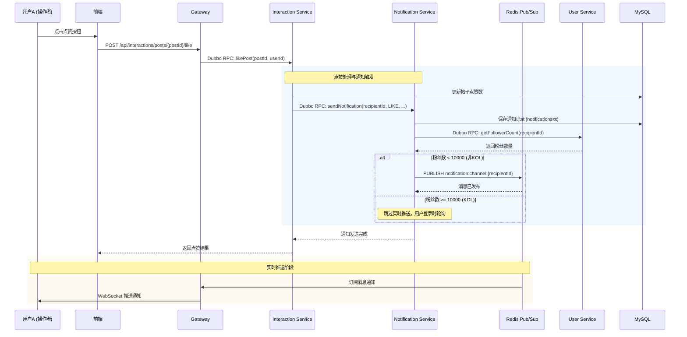
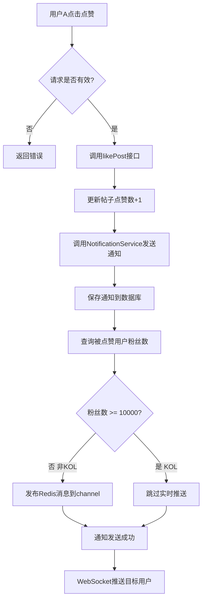
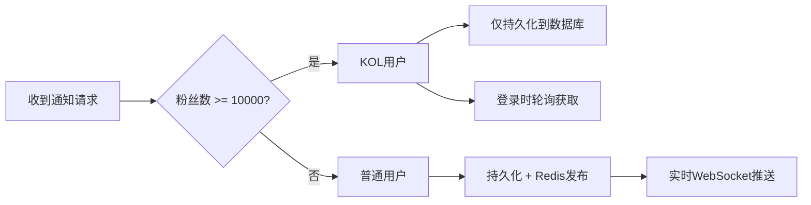
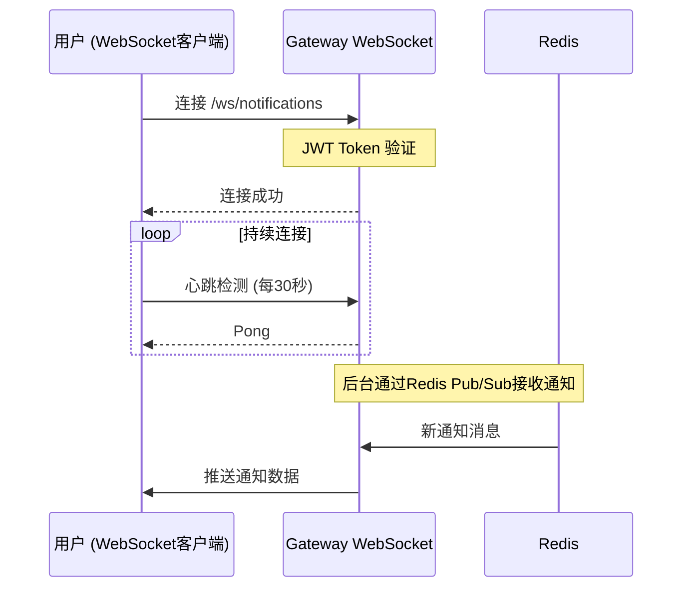

# 消息通知流程文档

## 1. 点赞通知流程概述

当用户 A 点赞用户 B 的帖子时，系统通过以下组件完成实时通知推送：



## 2. 核心组件职责

| 组件 | 职责 |
|------|------|
| **Gateway** | JWT鉴权、WebSocket服务、路由分发 |
| **Interaction Service** | 处理点赞/评论等互动操作，调用通知服务 |
| **Notification Service** | 通知持久化、KOL判断、Redis消息发布 |
| **User Service** | 提供用户信息查询服务 |
| **Redis** | Pub/Sub消息通道、缓存 |
| **MySQL** | 通知数据持久化存储 |

## 3. 详细流程步骤



## 4. KOL通知策略

根据 CLAUDE.md 中的设计：

> **KOL Notification Model:** 用户 with >= 10,000 followers don't receive real-time WebSocket pushes; they poll on login instead.



## 5. 消息格式

### 5.1 Redis Pub/Sub 消息

```
Channel: notification:channel:{recipientId}
Message: {notificationId}:{type}:{actorId}:{targetId}:{targetType}
```

示例：
```
Channel: notification:channel:2
Message: 123:LIKE:1:456:POST
```

### 5.2 消息字段说明

| 字段 | 类型 | 说明 |
|------|------|------|
| notificationId | Long | 通知ID |
| type | String | 通知类型 (LIKE/COMMENT/FOLLOW) |
| actorId | Long | 触发通知的用户ID |
| targetId | Long | 目标ID (帖子ID/评论ID) |
| targetType | String | 目标类型 (POST/COMMENT) |

## 6. 数据库表结构

```sql
-- notifications 表
CREATE TABLE notifications (
    id BIGINT AUTO_INCREMENT PRIMARY KEY,
    recipient_id BIGINT NOT NULL,      -- 接收通知的用户ID
    type VARCHAR(20) NOT NULL,         -- LIKE/COMMENT/FOLLOW
    actor_id BIGINT NOT NULL,          -- 触发通知的用户ID
    target_id BIGINT NOT NULL,          -- 目标ID
    target_type VARCHAR(50),            -- 目标类型
    is_read TINYINT(1) DEFAULT 0,     -- 是否已读
    created_at TIMESTAMP,
    updated_at TIMESTAMP,
    INDEX idx_recipient_id (recipient_id),
    INDEX idx_created_at (created_at)
);
```

## 7. WebSocket连接流程



## 8. 错误处理

### 8.1 UserService不可用时

当 `getFollowerCount()` 调用失败时，系统默认将用户视为非KOL，直接发送实时通知：

```java
try {
    Long followerCount = userService.getFollowerCount(recipientId);
    isKol = followerCount != null && followerCount >= kolFollowerThreshold;
} catch (Exception e) {
    log.warn("Failed to get follower count, treating as non-KOL: {}", e.getMessage());
    isKol = false; // 降级处理，确保通知发送
}
```

### 8.2 通知发送失败

| 错误场景 | 处理方式 |
|---------|---------|
| Redis连接失败 | 记录日志，通知持久化成功即可 |
| 数据库保存失败 | 向上抛出异常 |
| WebSocket断开 | 用户重连后通过轮询获取离线通知 |

## 9. 相关配置

### 9.1 Notification Service配置

```yaml
notification:
  kol:
    follower-threshold: 10000  # KOL粉丝数阈值
```

### 9.2 Dubbo服务版本

```yaml
# NotificationService
@DubboService(interfaceClass = NotificationService.class, version = "1.0.0")

# UserService引用
@DubboReference(version = "1.0.0", check = false)
private UserService userService;
```

## 10. 性能优化

- **通知持久化**: 所有通知先落库，保证可靠性
- **KOL降级**: 大V用户不进行实时推送，减少Redis压力
- **异步处理**: 通知发送为异步调用，不阻塞主流程
- **连接复用**: Dubbo连接池管理长连接
